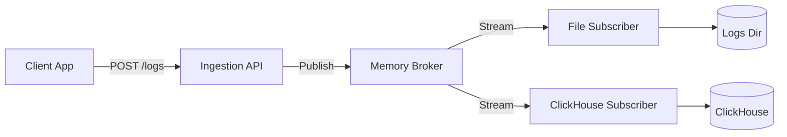

# Logtopus 🐙

A high-performance, scalable logging ingestion service written in Go. Logtopus accepts logs via HTTP, authenticates clients, and streams logs to configurable subscribers (File, ClickHouse, etc.) via an internal Pub/Sub broker.

## Features

-   **HTTP Ingestion API**: `POST /v1/logs` accepts batches of JSON logs.
-   **Authentication**: Fast, stateless HMAC-based API Key verification.
-   **Pluggable Architecture**:
    -   **Broker**: Decouples producers (API) from consumers.
    -   **Subscribers**: Currently supports File System (rotation by Session ID) and ClickHouse (mocked).
-   **Configuration**: 12-factor app compliant (Environment Variables).

## Getting Started

### Prerequisites

-   Go 1.22+
-   Make

### Installation

Clone the repository:
```bash
git clone https://github.com/predatorx7/logtopus.git
cd logtopus
```

### Configuration

Copy the example environment file:
```bash
cp .env.example .env
```

Edit `.env` to configure ports, secrets, and toggle subscribers.

### Running Locally

```bash
make run
```
The service will start on port `8080` (or `PORT` env var).

### CLI: Generating API Keys

To produce logs, you need an API Key signed with your server's `AUTH_SECRET`.

```bash
# Build the tool
make build

# Generate a key
./bin/apikey-gen -client=my-app -secret=change-me-in-prod-secret-key-123
```
*Output example:* `my-app.v-pY8eHXoyNjk...`

### Sending Logs

```bash
curl -X POST http://localhost:8080/v1/logs \
  -H "Content-Type: application/json" \
  -H "X-API-Key: <YOUR_API_KEY>" \
  -d '[
    {
      "level": "INFO",
      "message": "Hello World",
      "logger_name": "test_logger",
      "time": "2024-01-01T12:00:00Z",
      "sequence": 1,
      "session_id": "session_123"
    }
  ]'
```

## Development

### Running Tests

Run unit tests:
```bash
make test
```

Check code coverage:
```bash
make coverage
```

### Project Structure

-   `cmd/`
    -   `ingestor/`: Main HTTP service entrypoint and handler.
    -   `apikey-gen/`: CLI tool for key generation.
-   `pkg/`
    -   `model/`: Core data structures (`LogEntry`).
    -   `broker/`: Pub/Sub interfaces and implementation.
    -   `auth/`: API Key logic.
    -   `subscriber/`: Subscriber implementations (File, ClickHouse).

## Architecture



## License
MIT
